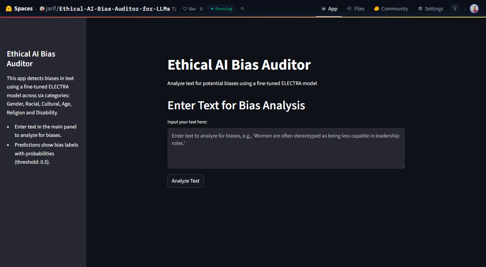

# Ethical AI Bias Auditor



  

The **Ethical AI Bias Auditor** is a Streamlit-based web application that detects biases in text using a fine-tuned ELECTRA model. It classifies text across six bias categories: Gender, Racial, Cultural, Age, Religion, and Disability, outputting predictions with probabilities (e.g., "Gender Bias (0.99), No Racial Bias (0.00), ..."). The app is designed for single-text input, with a user-friendly interface using Streamlit’s default theme.

## Features
- **Bias Detection**: Analyzes text for biases in six categories using a fine-tuned ELECTRA model (`google/electra-base-discriminator`).
- **Streamlit Interface**: Simple, centered UI with a text area for input and clear prediction output.
- **Balanced Dataset**: Trained on a balanced dataset (~3,798 samples) using undersampling to address the original imbalance (28,101 No Bias vs. 1,899 Biased).
- **Efficient Deployment**: Runs locally with cached model loading for fast predictions.

## Installation

1. **Clone the Repository**:
   ```
   git clone https://github.com/jarif87/ethical-ai-bias-auditor-for-llms.git
   cd ethical-ai-bias-auditor
  ```
2. **Install Dependencies:**
- Ensure Python 3.8+ is installed, then install required packages:

```
streamlit
numpy==1.26.4
pandas==2.2.3
transformers==4.53.2
torch==2.6.0
```
3. **Prepare Model and Tokenizer:**
- Place the fine-tuned model files (e.g., pytorch_model.bin, config.json) in ./electrabert_model.
- Place the tokenizer files (e.g., vocab.txt, tokenizer_config.json) in ./tokenizer.
- If you need to train the model, refer to the Training Section (#training).

4. **Usage**

- Run the Streamlit App:
```
streamlit run streamlit_app.py

```

5. **Analyze Text:**
- Enter text in the text area (e.g., "Women are often stereotyped as being less capable in leadership roles.").
- Click "Analyze Text" to view bias predictions in the format: Gender Bias (0.99), No Racial Bias (0.00), ....

6. **Example Output**
```
Gender Bias (0.99), No Racial Bias (0.00), No Cultural Bias (0.00), No Age Bias (0.00), No Religion Bias (0.00), No Disability Bias (0.00)
```

### Project Structure


ethical-ai-bias-auditor/
├── streamlit_app.py                  # Streamlit app for bias detection
├── electrabert_model/      # Fine-tuned ELECTRA model files
├── tokenizer/              # Tokenizer files
|-- notebooks
|-- images
└── README.md               # Project documentation